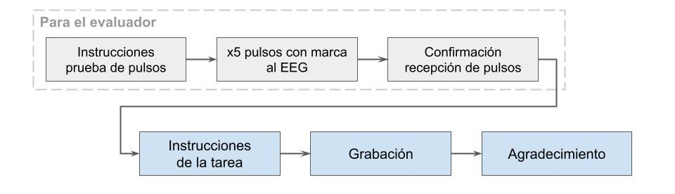

# Paradigma de Día Típico

El **Paradigma de Día Típico** fue desarrollado utilizando PsychoPy Builder. Está diseñado para grabar el audio de un paciente describiendo un día típico mientras tiene implantado un iEEG. El paradigma también envía marcadores al dispositivo de grabación para coordinar la sincronización de las señales.



El paradigma sigue estos pasos:
1. **Instrucciones**: Se presentan instrucciones para probar la conexión con el aparato de registro.
2. **Presentación de Pulsos**: Se envían 5 pulsos al aparato de registro con sonido simultaneo.
3. **Confirmación**: Aparece una pantalla para confirmar la recepción de los pulsos.
4. **Instrucciones**: El paradigma continúa con instrucciones para el paciente.
5. **Grabación**: Se graba la voz del paciente; deben pasar al menos 5 segundos antes de que se pueda presionar la barra espaciadora para detener la grabación.
6. **Agradecimientos**: Se muestra una pantalla de agradecimiento al final.

## Interacción con Arduino
Tanto al iniciar como al finalizar la grabación, el programa envía el carácter 'P' a un dispositivo Arduino. El Arduino procesa este carácter y responde generando un pulso. Esta elección de diseño permite que el Arduino sea controlado a través de la comunicación serial tanto desde Python como desde MATLAB, sin necesidad de reprogramarlo según el lenguaje de desarrollo. El paradigma no funcionará si no puede establecer comunicación serial.

## Requisitos

Antes de utilizar este paradigma, los requisitos necesarios son:
- Python 3.x
- Librerías de Python requeridas, que se encuentran en el archivo requirements.txt
- Arduino Uno o un dispositivo similar
- Arduino IDE (para cargar código en el Arduino, si es necesario)

## Uso

1. **Configuración del Arduino (si aplica):**
   - Conectar tu Arduino Uno al puerto USB de tu computadora.
   - Cargar el código proporcionado que se encuentra en la carpeta `resources` al Arduino utilizando el Arduino IDE. Este código permite que el Arduino genere pulsos en respuesta a un comando.

2. **Configuración de Python:**
   - Asegúrate de que las librerías de Python requeridas estén instaladas. Puedes instalarlas usando:
     ```bash
     pip install -r requirements.txt.
     ```

   - En el componente de código (`code`), se puede configurar la velocidad de transmisión (`baud_rate`) y establecer la frecuencia de muestreo (`sample_rate`) para el micrófono (probablemente no necesario).

3. **Ejecución:**

   Para la narrativa del día típico en español:
   
   ```bash
   python typicalDayNarrativeSpanish_lastrun.py

 - NOTA: Se subió el archivo de PsychoPy (.psyexp) para ejecutarlo desde el builder.

## Contribuciones
Este proyecto está abierto a contribuciones y mejoras. Para contribuir o reportar problemas, no dudes en abrir un pull request o un issue en GitHub.

## Créditos
El Paradigma de fue desarrollado por Agustina Selser, Coordinadora de TI del Centro de Neurociencias Cognitivas en la Universidad de San Andrés, Argentina.

## Citaciones
Peirce J, Gray JR, Simpson S, MacAskill M, Höchenberger R, Sogo H, Kastman E, Lindeløv JK. (2019) PsychoPy2: Experiments in behavior made easy Behav Res 51: 195. https://doi.org/10.3758/s13428-018-01193-y """